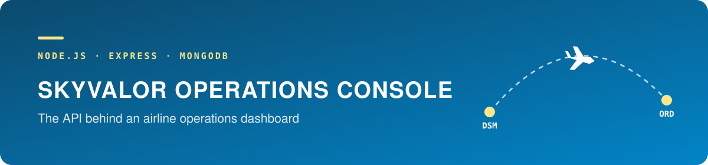
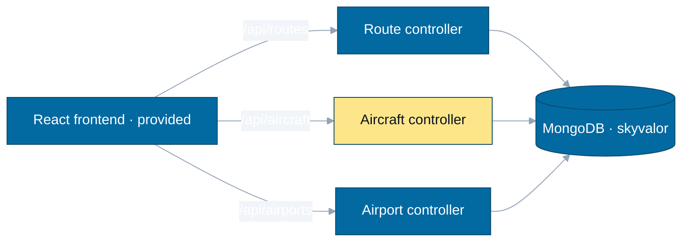

Iowa State University · COM S 3190 · Assignment 3 · Fall 2025

[Overview](#overview) · [Architecture](#architecture) · [My role](#my-role) · [Results](#results) · [Limitations](#limitations-and-next-steps)

---

> **Where it stands — Complete**  
> The provided React interface works end to end against our backend.  
> Verification was manual; there are no automated tests.

| | |
|---|---|
| Period | December 2025 (Fall 2025) |
| Team | 2 — Jongwoo Kim, David Lawlor (team NM_15) |
| My role | Aircraft controller, final integration, backend documentation |
| Stack | Node.js, Express, MongoDB (native driver), React, Vite, Tailwind CSS |

## Overview

- **The assignment:** the React frontend was provided complete by the course staff, with pages, forms and dialogs already wired to an API that did not exist. Our job was to build that API.
- **What we built:** an Express server with controllers and routers for routes, aircraft and airports under `/api`, backed by a shared MongoDB connection.

See [`backend/README.md`](backend/README.md) for setup and the full endpoint list, and [`frontend/README.md`](frontend/README.md) for the provided UI.

## Architecture

The highlighted controller is the one I finished.

## My role

- Finished the aircraft controller (create, read, update, delete, and the routes assigned to an aircraft).
- Did the final integration pass against the frontend.
- Wrote the backend README and recorded the submission video.

David set up the database connection and server, and wrote the route controller.

## What I learned

**Technical**
- Structuring an Express API as routers that map URLs to controller functions.
- Using the MongoDB driver directly instead of an ODM.
- Returning the status codes and JSON shapes a frontend already expects, and debugging against a UI I did not write.

**Teamwork**
- Building to a fixed contract: the frontend defined the API, so every disagreement had one right answer.
- Dividing work by resource (routes, aircraft) so two people could work in parallel.

## Resources used

- Express and MongoDB Node driver documentation
- Course lecture material and the provided frontend source
- MongoDB Compass for importing seed data

## Results

- The provided UI works against our backend: listing, creating, editing and deleting routes and aircraft.

## Limitations and next steps

- No automated tests; verification was manual through the UI.
- No authentication or input validation layer.
- Seed data must be imported by hand through MongoDB Compass.
- The `.env` file is committed. It only points at a local MongoDB, but it should be ignored.
